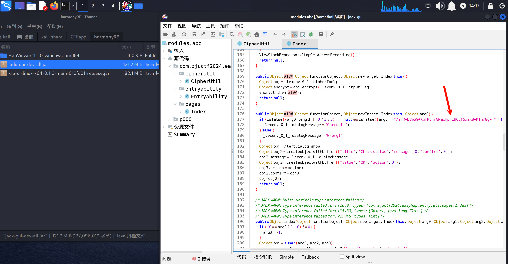
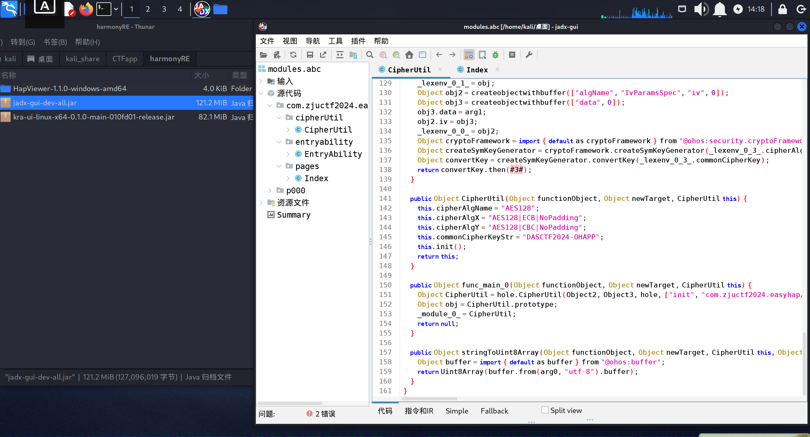
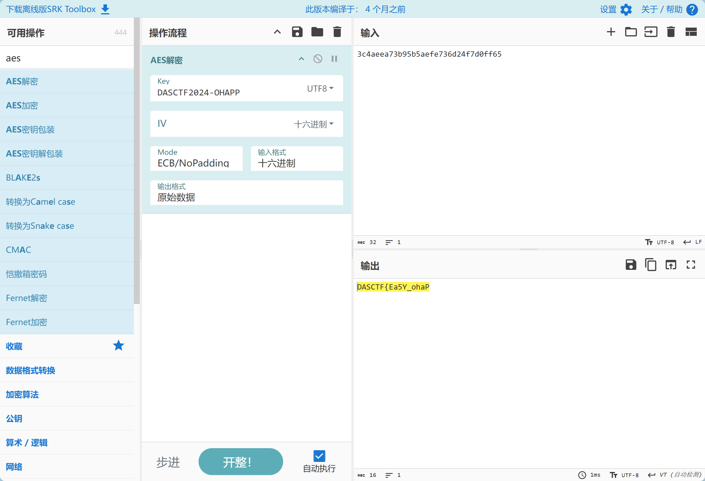
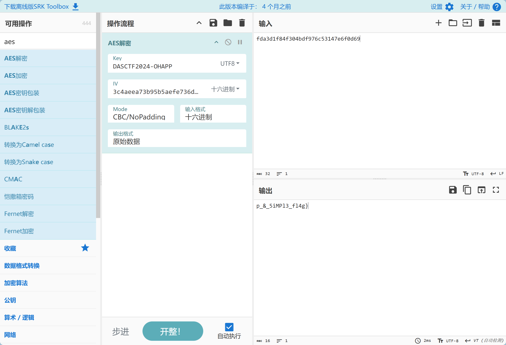

# [wp]浙江省网安决赛-信创安全赛道-鸿蒙app逆向 题解

在开始做题前,先唠叨几句,

先把工具准备好,工欲善其事,必先利其器;磨刀不误砍柴功.

由于鸿蒙系统这块是新出的,很多逆向工具都是民间开发者自己搓的,有很多bug,这个得理解一下.

然后鸿蒙逆向题总体思路上属于移动端应用的逆向,思路跟安卓逆向是一样的.无非就是工具比较少,以及app的开发语言从Java/Kotlin换成了ArkTS/仓颉.


下面开始工具介绍:

## 1.hap查看器

https://github.com/westinyang/hap-viewer

一个跨平台的hap查看器，方便开发者在电脑上预览hap的信息

## 2.ABCdecoder

https://github.com/Yricky/abcde

ABCDE是一个使用Kotlin编写的OpenHarmony逆向工具包，目前已经实现的功能为解析方舟字节码文件中 的类信息、方法信息、字面量数组信息以及对方法进行反汇编，解析资源索引文件等功能。

## 3.abc-decompiler

https://github.com/ohos-decompiler/abc-decompiler

界面是jadx

abc-decompiler 基于 [jadx](https://github.com/skylot/jadx/) 和 [abcde](https://github.com/Yricky/abcde/tree/main) 实现的鸿蒙 [abc/方舟字节码](https://developer.huawei.com/consumer/cn/doc/harmonyos-guides-V5/arkts-bytecode-fundamentals-V5#术语和约束) 的反编译工具.

使用方法帖:
[分享] [转帖] abc-decompiler 鸿蒙 abc/方舟字节码 的反编译工具-HarmonyOS-看雪-安全社区|安全招聘|kanxue.com https://bbs.kanxue.com/thread-283162.htm

[原创] 鸿蒙hap应用反编译工具 abc-decompiler 使用分享-HarmonyOS-看雪-安全社区|安全招聘|kanxue.com https://bbs.kanxue.com/thread-283225.htm

***

后面两个要在linux上运行,不过作者Q群里说win上也可以运行,可能是我自己win的java环境有点问题,不过无伤大雅,能用就行.

***

好,题解开始:

先把题目下载下来[信创-OH附件-202411090923.zip](https://github.com/Sciencekex/-wp-OHapp_re/blob/main/信创-OH附件-202411090923.zip)

然后打开linux虚拟机,

要一直解压.app文件,道理跟一直解压.apk文件一样,都是打包压缩好的安装包文件


最核心的逻辑在.abc文件里面,这是一个二进制文件,要拖进abc-decompiler反编译成java伪代码:

可以看到密文在index文件里:



`/aPR+E8wS9+XbFMUfm8NacHpP190pf5xaR8+MIm/8gw=`

是个base64

加密逻辑在CipherUtil这个文件里:



看一下,(长代码块警告⚠️):

```java
package com.zjuctf2024.easyhap.entry.ets.cipherUtil;

/* loaded from: /home/kali/桌面/modules.abc */
class CipherUtil {

    /* renamed from: pkgName@entry, reason: not valid java name */
    public Object f0pkgNameentry;
    public Object isCommonjs;
    public Object moduleRecordIdx;

    public Object #1#(Object functionObject, Object newTarget, CipherUtil this, Object arg0) {
        Object obj = _lexenv_0_2_.cipherX;
        Object init = obj.init(import { default as cryptoFramework } from "@ohos:security.cryptoFramework".CryptoMode.ENCRYPT_MODE, arg0, 0);
        return init.then(#2#);
    }

    public Object #2#(Object functionObject, Object newTarget, CipherUtil this) {
        Object obj = _lexenv_0_2_.cipherX;
        return obj.doFinal(_lexenv_0_0_);
    }

    public Object #3#(Object functionObject, Object newTarget, CipherUtil this, Object arg0) {
        Object obj = _lexenv_0_3_.cipherY;
        Object init = obj.init(import { default as cryptoFramework } from "@ohos:security.cryptoFramework".CryptoMode.ENCRYPT_MODE, arg0, _lexenv_0_0_);
        return init.then(#4#);
    }

    public Object #4#(Object functionObject, Object newTarget, CipherUtil this) {
        Object obj = _lexenv_0_3_.cipherY;
        return obj.doFinal(_lexenv_0_1_);
    }

    public Object #5#(Object functionObject, Object newTarget, CipherUtil this, Object arg0, Object arg1) {
        arg0("");
        return null;
    }

    public Object #6#(Object functionObject, Object newTarget, CipherUtil this, Object arg0, Object arg1) {
        newlexenv(1);
        _lexenv_0_0_ = arg0;
        Object ldlexvar = _lexenv_1_5_;
        Object encryptX = ldlexvar.encryptX(_lexenv_1_0_);
        encryptX.then(#7#);
        return null;
    }

    public Object #7#(Object functionObject, Object newTarget, CipherUtil this, Object arg0) {
        _lexenv_1_1_ = arg0.data;
        Object ldlexvar = _lexenv_1_5_;
        Object encryptY = ldlexvar.encryptY(_lexenv_1_2_, _lexenv_1_1_);
        encryptY.then(#8#);
        return null;
    }

    public Object #8#(Object functionObject, Object newTarget, CipherUtil this, Object arg0) {
        _lexenv_1_3_ = arg0.data;
        Object ldlexvar = _lexenv_1_5_;
        Object encodeX = ldlexvar.encodeX(_lexenv_1_1_, _lexenv_1_3_);
        Object ldlexvar2 = _lexenv_1_5_;
        _lexenv_0_0_(ldlexvar2.encodeY(encodeX));
        return null;
    }

    public Object init(Object functionObject, Object newTarget, CipherUtil this) {
        Object cryptoFramework = import { default as cryptoFramework } from "@ohos:security.cryptoFramework";
        this.cipherX = cryptoFramework.createCipher(this.cipherAlgX);
        Object cryptoFramework2 = import { default as cryptoFramework } from "@ohos:security.cryptoFramework";
        this.cipherY = cryptoFramework2.createCipher(this.cipherAlgY);
        Object obj = createobjectwithbuffer(["data", 0]);
        obj.data = this.stringToUint8Array(this.commonCipherKeyStr);
        this.commonCipherKey = obj;
        return null;
    }

    /* JADX WARN: Type inference failed for: r14v16, types: [int] */
    /* JADX WARN: Type inference failed for: r14v18, types: [int] */
    public Object encodeX(Object functionObject, Object newTarget, CipherUtil this, Object arg0, Object arg1) {
        Object[] objArr = [Object];
        for (int i = 0; isfalse((i < 16 ? 1 : 0)) == null; i++) {
            objArr.push(arg1[i]);
        }
        for (int i2 = 0; isfalse((i2 < 16 ? 1 : 0)) == null; i2++) {
            objArr.push(arg0[i2] ^ arg1[i2]);
        }
        return Uint8Array(objArr);
    }

    /* JADX WARN: Type inference failed for: r6v2, types: [Object, java.lang.Class] */
    public Object encodeY(Object functionObject, Object newTarget, CipherUtil this, Object arg0) {
        Object newobjrange = import { default as util } from "@ohos:util".Base64Helper();
        return newobjrange.encodeToStringSync(arg0);
    }

    public Object encrypt(Object functionObject, Object newTarget, CipherUtil this, Object arg0) {
        newlexenv(6);
        _lexenv_0_4_ = newTarget;
        _lexenv_0_5_ = this;
        _lexenv_0_3_ = null;
        _lexenv_0_1_ = null;
        if (isfalse((arg0.length != 32 ? 1 : 0)) == null) {
            return Promise(#5#);
        }
        Object ldlexvar = _lexenv_0_5_;
        _lexenv_0_0_ = ldlexvar.stringToUint8Array(arg0.slice(0, 16));
        Object ldlexvar2 = _lexenv_0_5_;
        _lexenv_0_2_ = ldlexvar2.stringToUint8Array(arg0.slice(16, 32));
        return Promise(#6#);
    }

    public Object encryptX(Object functionObject, Object newTarget, CipherUtil this, Object arg0) {
        newlexenv(3);
        _lexenv_0_1_ = newTarget;
        _lexenv_0_2_ = this;
        Object obj = createobjectwithbuffer(["data", 0]);
        obj.data = arg0;
        _lexenv_0_0_ = obj;
        Object cryptoFramework = import { default as cryptoFramework } from "@ohos:security.cryptoFramework";
        Object createSymKeyGenerator = cryptoFramework.createSymKeyGenerator(_lexenv_0_2_.cipherAlgName);
        Object convertKey = createSymKeyGenerator.convertKey(_lexenv_0_2_.commonCipherKey);
        return convertKey.then(#1#);
    }

    public Object encryptY(Object functionObject, Object newTarget, CipherUtil this, Object arg0, Object arg1) {
        newlexenv(4);
        _lexenv_0_2_ = newTarget;
        _lexenv_0_3_ = this;
        Object obj = createobjectwithbuffer(["data", 0]);
        obj.data = arg0;
        _lexenv_0_1_ = obj;
        Object obj2 = createobjectwithbuffer(["algName", "IvParamsSpec", "iv", 0]);
        Object obj3 = createobjectwithbuffer(["data", 0]);
        obj3.data = arg1;
        obj2.iv = obj3;
        _lexenv_0_0_ = obj2;
        Object cryptoFramework = import { default as cryptoFramework } from "@ohos:security.cryptoFramework";
        Object createSymKeyGenerator = cryptoFramework.createSymKeyGenerator(_lexenv_0_3_.cipherAlgName);
        Object convertKey = createSymKeyGenerator.convertKey(_lexenv_0_3_.commonCipherKey);
        return convertKey.then(#3#);
    }

    public Object CipherUtil(Object functionObject, Object newTarget, CipherUtil this) {
        this.cipherAlgName = "AES128";
        this.cipherAlgX = "AES128|ECB|NoPadding";
        this.cipherAlgY = "AES128|CBC|NoPadding";
        this.commonCipherKeyStr = "DASCTF2024-OHAPP";
        this.init();
        return this;
    }

    public Object func_main_0(Object functionObject, Object newTarget, CipherUtil this) {
        Object CipherUtil = hole.CipherUtil(Object2, Object3, hole, ["init", "com.zjuctf2024.easyhap/entry/ets/cipherUtil/CipherUtil.init", 0, "encryptX", "com.zjuctf2024.easyhap/entry/ets/cipherUtil/CipherUtil.encryptX", 1, "encryptY", "com.zjuctf2024.easyhap/entry/ets/cipherUtil/CipherUtil.encryptY", 2, "encodeX", "com.zjuctf2024.easyhap/entry/ets/cipherUtil/CipherUtil.encodeX", 2, "encodeY", "com.zjuctf2024.easyhap/entry/ets/cipherUtil/CipherUtil.encodeY", 1, "encrypt", "com.zjuctf2024.easyhap/entry/ets/cipherUtil/CipherUtil.encrypt", 1, "stringToUint8Array", "com.zjuctf2024.easyhap/entry/ets/cipherUtil/CipherUtil.stringToUint8Array", 1, 7]);
        Object obj = CipherUtil.prototype;
        _module_0_ = CipherUtil;
        return null;
    }

    public Object stringToUint8Array(Object functionObject, Object newTarget, CipherUtil this, Object arg0) {
        Object buffer = import { default as buffer } from "@ohos:buffer";
        return Uint8Array(buffer.from(arg0, "utf-8").buffer);
    }
}
```

AI总结一下:

```
分析一下这段代码的加密流程。这是一个使用AES加密的系统，看起来是某个CTF比赛(ZJUCTF2024)的题目。

这个加密系统的主要特点是:

采用分段加密的方式，将32字节的输入分成两部分处理
第一部分使用AES-ECB模式，第二部分使用AES-CBC模式
巧妙地使用第一部分的加密结果作为第二部分的IV
最终通过Base64输出结果

这种设计的有趣之处在于它混合使用了两种不同的AES模式，并且通过将它们的结果关联起来增加了加密的复杂性。这看起来是专门为CTF比赛设计的一个加密挑战。


# ZJUCTF2024 EasyHap 加密分析

## 关键参数

1. 加密算法配置:
   - 算法名称: `AES128`
   - X模式: `AES128|ECB|NoPadding`
   - Y模式: `AES128|CBC|NoPadding` 
   - 通用密钥: `DASCTF2024-OHAPP`

2. 输入要求:
   - 输入字符串长度必须为32字节
   - 会被分为两个16字节的部分分别处理

## 加密流程

1. **初始化阶段** (`init`方法):
   - 创建两个cipher实例:
     - cipherX: 使用ECB模式
     - cipherY: 使用CBC模式
   - 将通用密钥字符串转换为Uint8Array格式

2. **主加密流程** (`encrypt`方法):
   ```
   输入(32字节) -> 前16字节 -> encryptX处理
                -> 后16字节 -> encryptY处理(使用encryptX的结果作为IV)
                -> 结果合并 -> Base64编码
   ```

3. **详细步骤**:
   a. 输入检查:
      - 验证输入长度是否为32字节
      - 将输入分为两个16字节部分
   
   b. X部分加密 (`encryptX`):
      - 使用ECB模式对前16字节进行加密
      - 不使用填充
   
   c. Y部分加密 (`encryptY`):
      - 使用CBC模式对后16字节进行加密
      - 使用X部分的加密结果作为IV
      - 不使用填充
   
   d. 结果处理 (`encodeX` 和 `encodeY`):
      - encodeX: 将X部分和Y部分的结果组合
      - encodeY: 对组合结果进行Base64编码

## 特殊之处

1. 使用了两种不同的AES模式(ECB和CBC)串联
2. CBC模式的IV来自ECB模式的输出
3. 两个部分都使用了NoPadding，这要求输入必须是16字节的倍数
4. 最终输出是Base64编码的形式

## 安全性分析

1. ECB模式的使用可能带来安全隐患，因为相同的明文块会产生相同的密文块
2. 使用固定的密钥字符串可能存在风险
3. CBC模式使用前一部分的加密结果作为IV增加了加密的复杂性
```


核心逻辑:

```
输入(32字节) -> 前16字节 -> encryptX处理
             -> 后16字节 -> encryptY处理(使用encryptX的结果作为IV)
             -> 结果合并 -> Base64编码
```

```
然后在"结果合并"这块是:
前16字节的处理结果+(后16字节的处理结果^前16字节的处理结果) -> 32字节
```


所以解密的话就是逆着来:

(长代码块警告⚠️)

```python
import base64

def decode_base64_to_hex(encoded_str):
    try:
        # 将 Base64 字符串解码为字节
        decoded_bytes = base64.b64decode(encoded_str)
        # 将字节转换为 0x 开头的十六进制字符串列表
        hex_list = [f"0x{byte:02x}" for byte in decoded_bytes]
        return hex_list
    except Exception as e:
        return f"解码失败: {e}"

# 示例用法
encoded_str = "/aPR+E8wS9+XbFMUfm8NacHpP190pf5xaR8+MIm/8gw="
print("解码结果:", decode_base64_to_hex(encoded_str))

```

**解码结果: ['0xfd', '0xa3', '0xd1', '0xf8', '0x4f', '0x30', '0x4b', '0xdf', '0x97', '0x6c', '0x53', '0x14', '0x7e', '0x6f', '0x0d', '0x69', '0xc1', '0xe9', '0x3f', '0x5f', '0x74', '0xa5', '0xfe', '0x71', '0x69', '0x1f', '0x3e', '0x30', '0x89', '0xbf', '0xf2', '0x0c']**

```python
def decodeX(arg):
    # 初始化结果数组
    objArr = []

    # 将 arg 的前 16 个元素添加到 objArr
    for i in range(16):
        objArr.append(arg[i])

    arg1 = arg[0:16]
    arg0 = arg[16:32]
    # 将 arg0 和 arg1 对应元素的异或结果添加到 objArr
    for i in range(16):
        objArr.append(arg1[i] ^ arg0[i])

    # 返回十六进制表示的结果列表
    return [hex(x) for x in objArr]


# 使用
arg = [0xfd, 0xa3, 0xd1, 0xf8, 0x4f, 0x30, 0x4b, 0xdf, 0x97, 0x6c, 0x53, 0x14, 0x7e, 0x6f, 0x0d, 0x69,
       0xc1, 0xe9, 0x3f, 0x5f, 0x74, 0xa5, 0xfe, 0x71, 0x69, 0x1f, 0x3e, 0x30, 0x89, 0xbf, 0xf2, 0x0c]
arg1 = arg[0:16]
arg0 = arg[16:32]

decoded_result = decodeX(arg)
print("前面是arg1=CBC-iv,后面是arg0")
print(decoded_result)
结果 = [
    0xfd, 0xa3, 0xd1, 0xf8, 0x4f, 0x30, 0x4b, 0xdf, 0x97, 0x6c, 0x53, 0x14, 0x7e, 0x6f, 0x0d, 0x69,
    0x3c, 0x4a, 0xee, 0xa7, 0x3b, 0x95, 0xb5, 0xae, 0xfe, 0x73, 0x6d, 0x24, 0xf7, 0xd0, 0xff, 0x65
]

```

**前面是arg1=CBC-iv,后面是arg0**
**['0xfd', '0xa3', '0xd1', '0xf8', '0x4f', '0x30', '0x4b', '0xdf', '0x97', '0x6c', '0x53', '0x14', '0x7e', '0x6f', '0xd', '0x69', '0x3c', '0x4a', '0xee', '0xa7', '0x3b', '0x95', '0xb5', '0xae', '0xfe', '0x73', '0x6d', '0x24', '0xf7', '0xd0', '0xff', '0x65']**

最后用赛博厨子的AES解密模块出:





```
fda3d1f84f304bdf976c53147e6f0d69 ->: part2 p_&_5iMPl3_fl4g}
3c4aeea73b95b5aefe736d24f7d0ff65 ->: part1 DASCTF{Ea5Y_ohaP

DASCTF{Ea5Y_ohaPp_&_5iMPl3_fl4g}
```

得到了!

DASCTF{Ea5Y_ohaPp_&_5iMPl3_fl4g}

***

(本文为作者与AI配合完成)

